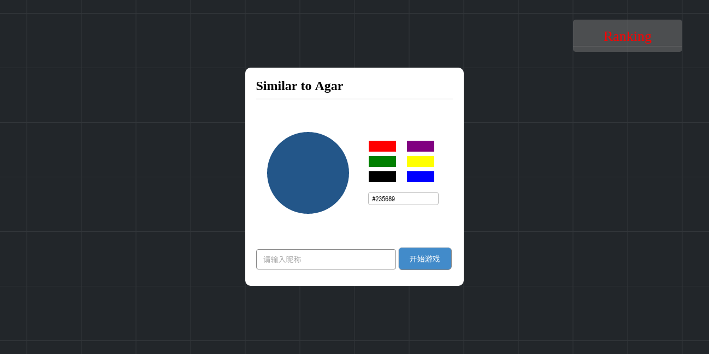

# A simple back-end frame and a simple web game base on WebSocket

## demo说明
这是一个简易的服务器，同时基于websocket搭载了一个简易的类似于球球大作战的小游戏。

## 运行demo
在浏览器中输入`python main.py`，即可启动一个服务器，监听8080端口
然后在浏览器中输入`127.0.0.1:8080`，即可进入游戏界面，支持多人在线。

如果想修改监听地址，可以在命令行中指定，比如`python main.py 0.0.0.0:4040`，监听80号端口需要root权限。

## 游戏效果

